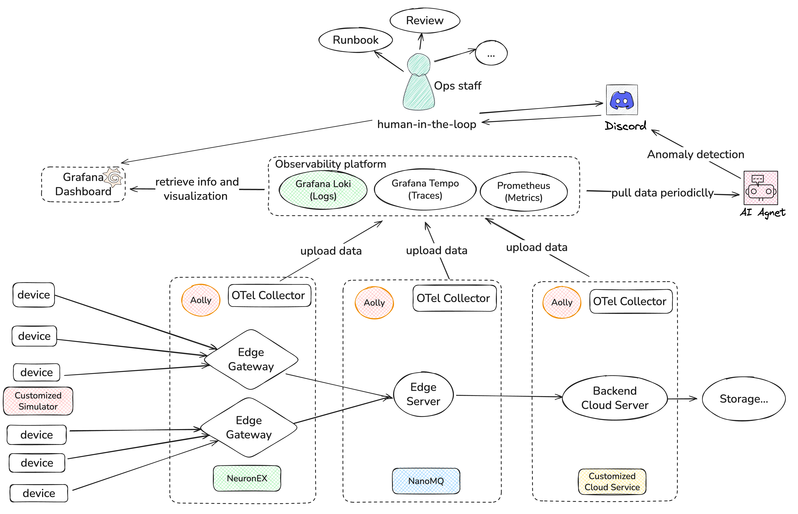
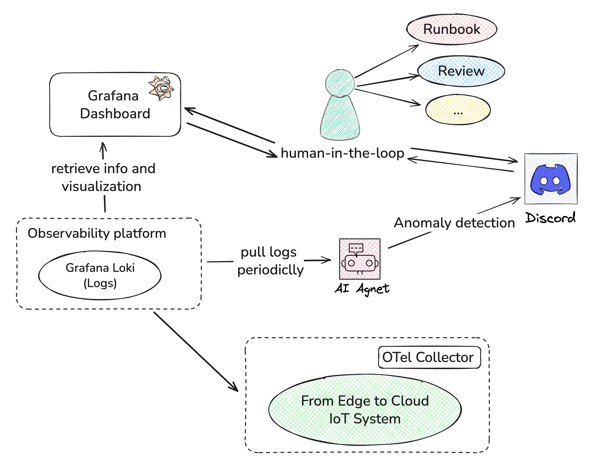

# Overview
I want to build a multi-layer IoT system’s observability and intelligent operation and maintenance closed loop, from the device side to the cloud, to AI and Human-in-the-loop. This reflects the synergistic value of Observability × AI × Human in a multi-continuum environment.

# What I want to do
Through an IoT system simulation (Python simulator), it demonstrates how to use OpenTelemetry + Loki to achieve end-to-end observability, and use an AI Agent (including Discord Bot) to automatically detect anomalies, generate alarms, and accept manual confirmation to form an AI-Human-Observability closed loop.

And **It will show**:
- The logs collecting from all layers of the IoT system;

- Data pipeline construction and Exporter configuration of OTel Collector;

- AI Agent’s analysis and interpretation of observation data;

- The integration of Human as a Service (HaaS) concepts in observable systems;

- Full process visualization (Grafana + Discord embed card).

# Tasks plan
## Stage 1: Observability pipeline construction ✅
Build the observation path, from Python Simulator/Gateway/Edge/Cloud → OTel Collector → Loki  → Grafana.

## Stage 2: AI Agent Anomaly Detection ✅
The AI Agent periodically reads log data, detects anomalies and pushes them to Discord, forming a closed loop of interaction.

## Stage 3: Integration and Demonstration Preparation
Complete the presentation script and documentation.

# What I learned
## Building an end-to-end IoT testing environment
## Constructing observability for an IoT system
## LLM system integration, prompt engineering, and log analysis with LLMs
## Experiment design skills
## Measuring QoA when using LLMs for log analysis

# QoA design
## Prerequisites
1. Use `generate_test_data.py` for fast log generation.
2. The generated logs follow the same format we ingest into Loki from `cloud_service.py`.
3. The simulated scenarios match those in `simulator.py`: (1) Normal Operation, (2) Cooling Failure.
## QoA measurements
### Different time windows (1 / 15 / 30 minutes)
1. Normal condition detection across each window:
   1. Response-time analysis
   2. Accuracy impact
2. Real-time failure detection (fault occurs within the last minute) across each window:
   1. Response-time analysis
   2. Accuracy impact
### Same time window (30 minutes)
1. Intermittent failures (tests AI recognition of complex patterns)
   - 5 minutes abnormal, 5 minutes normal, alternating
## Impact of past anomalies on real-time detection
- First 10 minutes abnormal, last 20 minutes normal